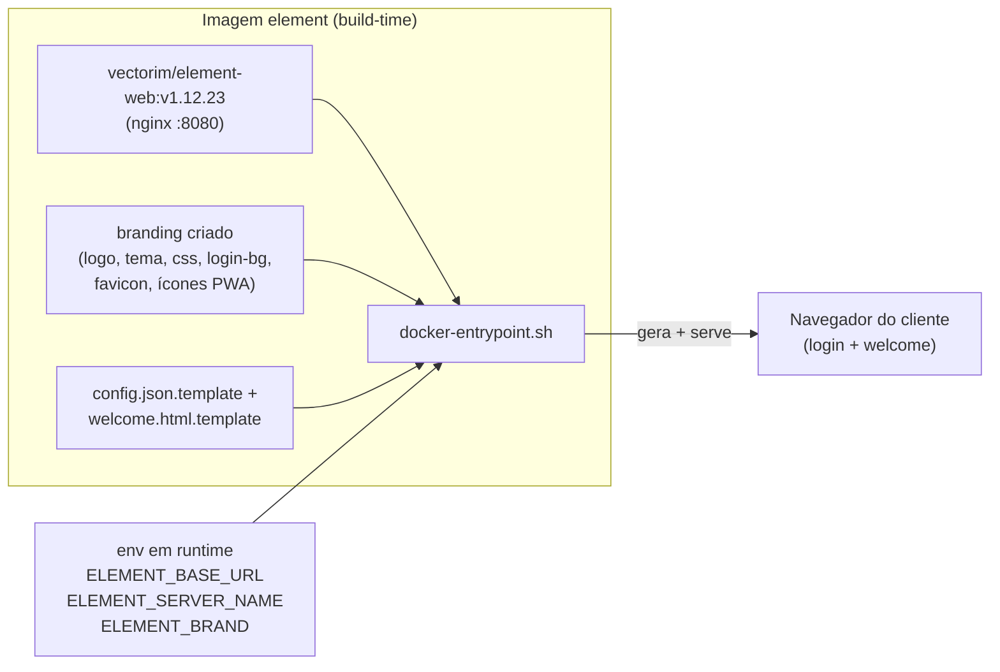
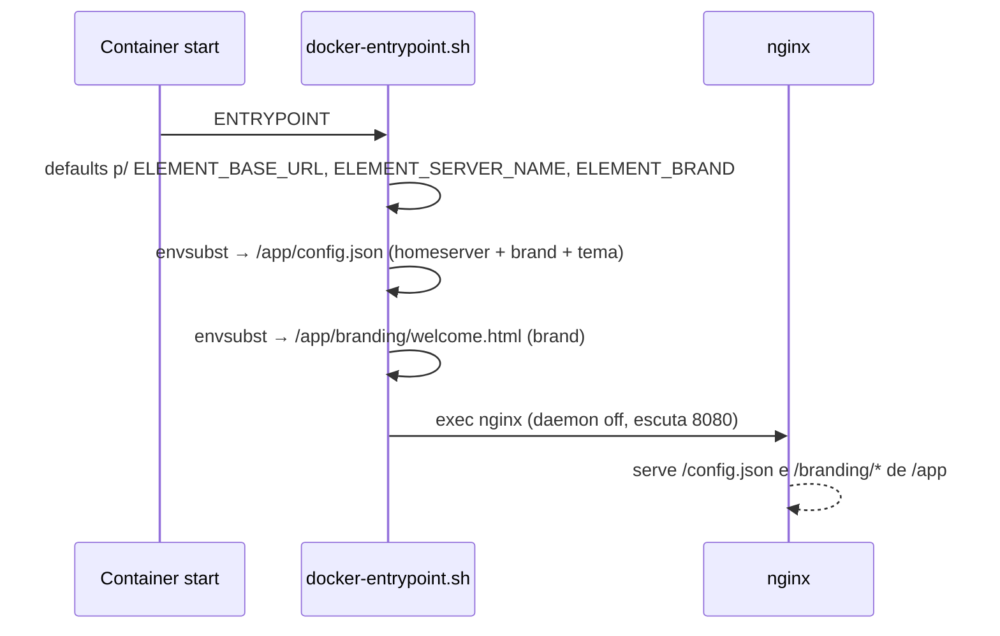

# element

Imagem Docker **white-label do [Element Web](https://github.com/element-hq/element-web)**
com um branding genérico criado (paleta e layout do site
[marcelomatos.dev](https://marcelomatos.dev) — tema escuro violeta → magenta → ciano).

Serve para **demonstrar o chat Matrix a novos clientes**: uma tela de login e de
boas-vindas já bonitas e neutras, prontas para apontar para qualquer homeserver e
exibir o nome da marca do cliente — **sem rebuild**, só variáveis de ambiente.

Imagem autocontida (o branding vai dentro dela), necessária para deploy em
**Swarm/cloud** (Portainer), onde bind mounts relativos não funcionam.

| | Preview |
|---|---|
| **Login** | painel com gradiente violeta → ciano, balão de chat branco, fundo escuro com _glows_ radiais |
| **Boas-vindas** | card com o nome da marca em gradiente, CTA "Entrar", ícone do app |

## Configuração (runtime, via env)

Só **três** coisas são configuráveis — tudo o mais (tema, CSS, ícones, fundo) é criado:

| Variável | Default | Descrição |
|---|---|---|
| `ELEMENT_BASE_URL` | `https://matrix.example.com` | `base_url` do homeserver Matrix |
| `ELEMENT_SERVER_NAME` | `example.com` | `server_name` (a identidade `@user:server_name`) |
| `ELEMENT_BRAND` | `Chat` | nome exibido no título, no `config.json` e na página de boas-vindas |

## O que é criado vs. configurável

| Criado (fixo na imagem) | Configurável (env, runtime) |
|---|---|
| Tema escuro (paleta marcelomatos.dev), `custom.css`, logos, favicon/ícones PWA | `ELEMENT_BASE_URL` |
| `login-bg.jpg`, template do `welcome.html`, injeção do CSS no `index.html` | `ELEMENT_SERVER_NAME` |
| Cores do tema, gradientes de login/botões | `ELEMENT_BRAND` (nome da marca) |

## Paleta (origem: marcelomatos.dev)

| Papel | Cor |
|---|---|
| Fundo | `#070611` |
| Texto | `#f3f0ff` · secundário `#a99fce` |
| Accent (violeta) | `#7c3aed` |
| Primário/magenta | `#d946ef` |
| Ciano | `#06b6d4` |
| Gradiente de login | violeta → ciano · Botões | violeta → magenta |

## Arquitetura



## Fluxo do container (start → serve)



> Roda como root para gravar `/app/config.json` e `/app/branding/welcome.html`. Não usa
> a cadeia `/docker-entrypoint.d/` da base (que só roda como root e seria frágil); por
> isso o healthcheck é redefinido explicitamente em `127.0.0.1:8080` (IPv4).

## Build / run local

```bash
docker build -t element:dev .

# nginx do Element escuta na 8080 dentro do container
docker run --rm -p 8080:8080 \
  -e ELEMENT_BASE_URL=https://matrix.example.com \
  -e ELEMENT_SERVER_NAME=example.com \
  -e ELEMENT_BRAND="Acme Chat" \
  element:dev
# abra http://localhost:8080  (config em http://localhost:8080/config.json)
```

## Trocar de marca / homeserver (sem rebuild)

```bash
docker run --rm -p 8080:8080 \
  -e ELEMENT_BASE_URL=https://matrix.suaempresa.com \
  -e ELEMENT_SERVER_NAME=suaempresa.com \
  -e ELEMENT_BRAND="Sua Empresa" \
  element:dev
```

## Personalizar o branding (rebuild)

O visual fica em [`branding/`](branding/) e nos templates:

- `branding/custom.css` — gradiente do painel de login e botões
- `branding/logo-mark.svg` — marca mostrada no painel de login
- `branding/logo.png`, `branding/vector-icons/*`, `branding/favicon.ico` — ícones (app / PWA / favicon)
- `branding/login-bg.jpg` — fundo da tela de login
- `welcome.html.template` — página de boas-vindas (usa `${ELEMENT_BRAND}`)
- `config.json.template` — cores do tema custom "Dark"

Depois é só `docker build` de novo.

## Correções aplicadas sobre o Element base

### Mensagens de voz Opus/Ogg (FluffyChat) não tocavam

Mensagens de voz gravadas em clientes como o **FluffyChat** renderizavam waveform e
duração, mas ao dar play mostravam **"Erro ao baixar o áudio"** — apesar do arquivo baixar
e descriptografar normalmente. A falha era na **decodificação**, não no download.

A causa raiz tem duas camadas:

1. O decodificador nativo do navegador rejeita esse Opus/Ogg (`decodeAudioData` lança `DOMException`).
2. O Element tem um **fallback** que reencoda para WAV via WASM (`decodeOgg`), mas o alimenta
   com o **mesmo `ArrayBuffer`** que acabou de passar por `decodeAudioData()`. Pela spec da
   Web Audio API, `decodeAudioData()` **destaca (neutraliza) o buffer de entrada de forma
   síncrona — inclusive quando a decodificação falha**. O fallback então recebe um buffer
   destacado, estoura `TypeError: attempting to access detached ArrayBuffer` e **nunca roda**.

A imagem injeta [`branding/opus-fix.js`](branding/opus-fix.js) no `index.html` (build-time).
Ele envolve `BaseAudioContext.prototype.decodeAudioData` para entregar ao decodificador nativo
uma **cópia** do buffer — assim o buffer do chamador nunca é destacado, o fallback WASM do
próprio Element roda, decodifica o Opus e o áudio toca.

- **Não exige buildar o Element do fonte** (o bundle oficial é minificado).
- **Inofensivo** se o upstream corrigir: no pior caso, uma cópia a mais de um buffer pequeno
  (áudios > 5 MB nem passam por esse caminho — vão pelo elemento `<audio>`).

Bug ainda **aberto upstream**: [element-web#32034](https://github.com/element-hq/element-web/issues/32034)
(o `Playback.ts` é idêntico em `v1.12.21`…`v1.12.23` e no `develop` — subir a tag base **não** corrige).
Verificação repetível: cole [`specs/opus-fix.verify.js`](specs/opus-fix.verify.js) no console do navegador.

## Atualizar a versão do Element base

Trocar a tag no `FROM` do `Dockerfile` (`vectorim/element-web:vX.Y.Z`) e rebuildar.
Confira que a base nova ainda usa `#76CFA6` no `manifest.json` (o `sed` do tema falha em
silêncio se a cor mudar) e rode `specs/opus-fix.verify.js` no console: se o upstream tiver
corrigido o fallback, o shim continua inofensivo e pode ser removido.

## CI/CD (GitHub Actions → GHCR → Portainer)

A imagem é versionada em **SemVer** e publicada no **GHCR** (`ghcr.io/marcelofmatos/element`).

| Workflow | Gatilho | Faz |
|---|---|---|
| `release-and-build.yml` | manual (`workflow_dispatch`, patch/minor/major) | calcula SemVer, cria tag + release, builda e publica no GHCR (full/minor/major/latest) |
| `docker-image.yml` | push em `homolog`/`prod`, release, manual | builda/publica no GHCR por branch + dispara webhook de deploy |
| `deploy.yml` | após "Release and build" em `main` | dispara webhooks Portainer (HMG → PRD) |
| `docker-set-tag.yml` | manual | promove (re-aponta) uma docker tag para uma release |

**Secrets/variáveis** (Settings → Secrets and variables → Actions):
- `PORTAINER_DEPLOY_HMG_WEBHOOK_URL` / `PORTAINER_DEPLOY_PRD_WEBHOOK_URL` — webhooks do stack no Portainer
- (opcional) `WEBHOOK_DEPLOY_MAIN` / `WEBHOOK_DEPLOY_HOMOLOG` — usados pelo `docker-image.yml`
- Variável `USE_ENVIRONMENTS` (`true`/`false`) — liga/desliga os GitHub Environments no `deploy.yml`

> O `GITHUB_TOKEN` já tem `packages: write` para publicar no GHCR. Após o primeiro
> publish, deixe o **pacote GHCR público** (Packages → element → Package settings →
> Change visibility) para que a imagem seja _pullable_ anonimamente (ex.: pela stack do Portainer).

## Licença

O branding deste repositório é livre para uso. O **Element Web** empacotado é
distribuído sob **AGPL-3.0-only** — veja o
[projeto upstream](https://github.com/element-hq/element-web).
